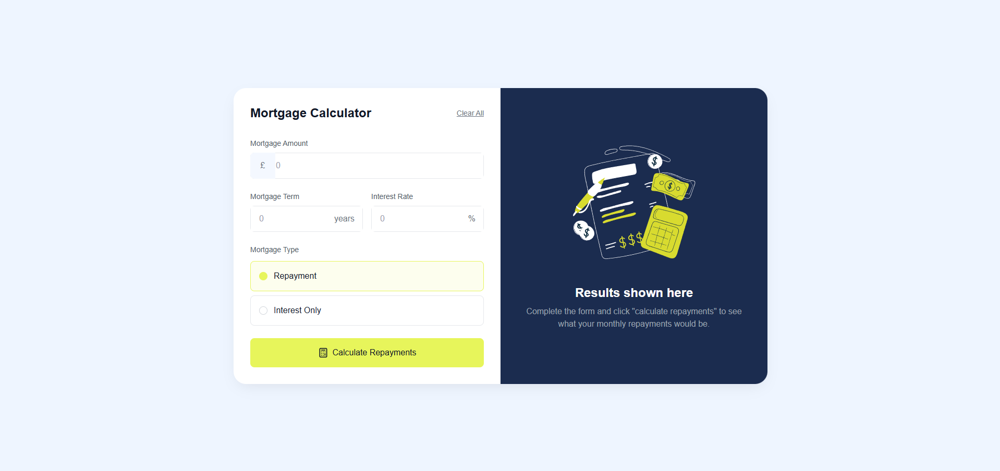

# Mortgage Repayment Calculator Solution

## Table of contents

- [Overview](#overview)
  - [The challenge](#the-challenge)
  - [Screenshot](#screenshot)
  - [Links](#links)
- [My process](#my-process)
  - [Built with](#built-with)
  - [What I learned](#what-i-learned)
  - [Continued development](#continued-development)
  - [Useful resources](#useful-resources)
- [Author](#author)

## Overview

### The challenge

Users should be able to:

- Input mortgage information and see monthly repayment and total repayment amounts after submitting the form
- See form validation messages if any field is incomplete
- Complete the form only using their keyboard
- View the optimal layout for the interface depending on their device's screen size
- See hover and focus states for all interactive elements on the page

### Screenshot



### Links

- Solution URL: [Add solution URL here]
- Live Site URL: [Add live site URL here]

## My process

### Built with

- [React](https://reactjs.org/) - JS library
- [Next.js](https://nextjs.org/) - React framework
- [Tailwind CSS](https://tailwindcss.com/) - For styles
- Flexbox
- CSS Grid
- Mobile-first workflow
- [TypeScript](https://www.typescriptlang.org/) - For type checking
- [Lucide React](https://lucide.dev/) - For icons

### What I learned

During this project, I learned how to:

- Implement a responsive design using Tailwind CSS
- Create a form with real-time validation in React
- Use TypeScript for better type safety in a React project
- Implement complex calculations for mortgage repayments
- Create custom radio buttons and style form elements
- Handle different states (default, error, results) in a single component

Here's a code snippet I'm particularly proud of:

```tsx
const calculateRepayments = () => {
  if (!validateForm()) return;

  const principal = Number(mortgageAmount);
  const years = Number(mortgageTerm);
  const rate = Number(interestRate) / 100 / 12;
  const numberOfPayments = years * 12;

  let monthlyPayment: number;

  if (mortgageType === "repayment") {
    monthlyPayment =
      (principal * rate * Math.pow(1 + rate, numberOfPayments)) /
      (Math.pow(1 + rate, numberOfPayments) - 1);
  } else {
    monthlyPayment = principal * rate;
  }

  const totalRepayment = monthlyPayment * numberOfPayments;

  setResult({
    monthlyPayment,
    totalRepayment:
      mortgageType === "repayment"
        ? totalRepayment
        : principal + totalRepayment,
  });
};
```
